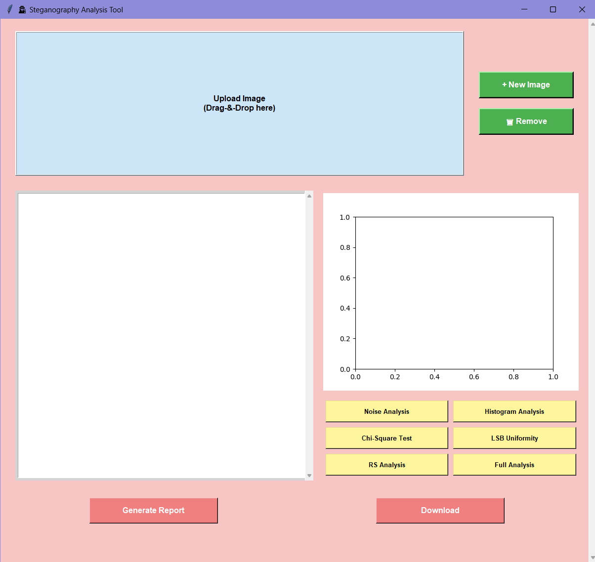

# 🐾 ImageWatchDog

**ImageWatchDog** is a modern, interactive tool for detecting hidden messages in images using classical steganalysis techniques. Designed with a beautiful GUI in Python, this application gives analysts, researchers, and students the ability to inspect images for suspicious patterns using techniques like LSB analysis, chi-square testing, noise estimation, and more.

 <!-- Optional: Add GUI screenshot here -->

---

## 🔍 Features

- 📂 **Drag-and-Drop Image Upload** or file browser support
- 🧪 **Built-in Steganalysis Tools**:
  - ✔️ LSB Uniformity Check
  - ✔️ Chi-Square Statistical Analysis
  - ✔️ Grayscale Histogram Visualization
  - ✔️ RS (Regular/Singular) Smoothness Analysis
  - ✔️ Noise Distribution Estimation
- 📊 Integrated **Matplotlib Visualization**
- 📝 Placeholder for PDF report generation and download
- 🖥️ Clean, scrollable, responsive GUI

---

## 📦 Requirements

Python 3.7 or higher. Install dependencies via:

```bash
pip install -r requirements.txt


## Steps to Follow
```bash
git clone https://github.com/yourusername/imageWatchDog.git
cd imageWatchDog

## Run The Application
```bash
python Image_WatchDog.py
